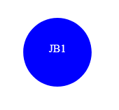

# Logo Generator

## Description

Logo Generator is a command line interface (CLI) application that generates logos based on user input. This project was made to provide an easy-to-use tool for creating simple logos for personal or professional use. This project eliminates having to use design software or spend significant periods of time creating a logo.

This project taught me how to use Node.js to build command line applications, work with third-party libraries like Inquirer, and write tests using Jest.

## Table of Contents

- [Installation](#installation)
- [Usage](#usage)
- [Credits](#credits)
- [License](#license)
- [Contributing](#contributing)
- [Tests](#tests)
- [Questions](#questions)

## Installation

To use this application, you will need to have Node.js installed on your system. You can download Node.js from the [official website.](https://nodejs.org/en)

Once you have installed Node.js, you can install the required dependencies by running the following commands in your terminal: "npm i inquirer@8.2.4" and "npm i --save-dev jest"

## Usage

To use this application a user can enter the "node index.js" command within an integrated terminal. From there the user will answer each question as prompted within the terminal. following the prompts a user will see a success message and the new logo.svg file will now be created. The file will be placed in the output folder and named "logo.svg"

 

 

[Video Demo]()

## Credits

[Screencastify](https://app.screencastify.com/)

[Npm](https://docs.npmjs.com/)

[Node.js](https://nodejs.org/en)

[Jest](https://jestjs.io/docs/getting-started)

## License

This application is licensed under the [MIT](https://opensource.org/licenses/MIT).

## Contributing

If you would like to contribe to this project contact me through the email found in the Questions section.

## Tests

Tests for each shapes rendering can be found in the shapes.test.js file. The test are written for jest, in order to run test use the "npm test" command in an integrated terminal.

## Questions

[GitHub](https://github.com/josh4got)

If you have any questions, please contact me at joshbottied1@gmail.com
